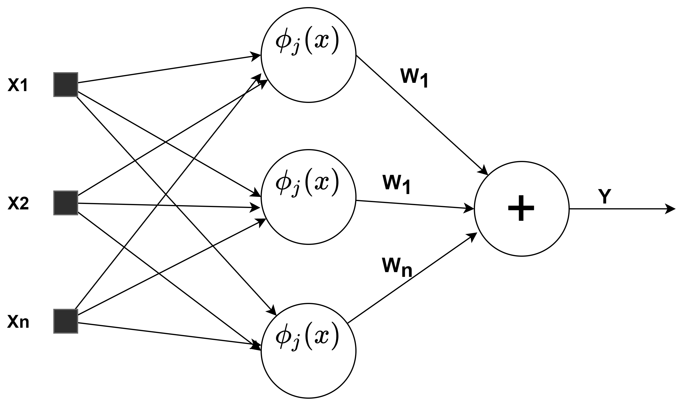

# Radial basis function network RBFN
#### descrição
Este repositorio contém uma implementação de uma rede neural de base radial(RBFN). Para a execução da mesma é necessário apenas a lib do numpy, porém para realizar os testes é necessário instalar a lib sklearn, para usar as funções de métricas e acessar o dataset do iris. Todas as funções da RBFN são implementadas manualmente, as decrições da mesma seguem abaixo. 




#### Execução e teste
```python
from sklearn.metrics import accuracy_score,confusion_matrix
from sklearn.model_selection import train_test_split
from sklearn.datasets import load_iris
import numpy as np
from lib.rbfnn import RBF #import do arquivo local

#Pegando e dividindo os dados de treinamento e teste
data = load_iris()
x = data['data']
y = data['target']
x_train, x_test, y_train, y_test = train_test_split(x, y, test_size=0.33, random_state=42)

rbf = RBF(6) #Instanciando a classe RBF com 6 clusters
rbf.fit(x_train,y_train)#Fazendo o treinamento com os dados de treino
result = rbf.predict(x_test)#realizando a predição
#print dos resultados.
print('accuracy: ',accuracy_score(result,y_test))
print('confusion_matrix: ',confusion_matrix(result,y_test)
)

```

#### Dependencias
```python
from sklearn.metrics import accuracy_score,confusion_matrix
from sklearn.model_selection import train_test_split
from sklearn.datasets import load_iris
from lib.rbfnn import RBF #import do arquivo local
import numpy as np
```

#### RBFNN
```python
#Classe principal, RBFNN
class RBF():
#paramentros iniciais,recebe a quantidade de centros e o numero de épocas
def __init__(self,n_clusters, epochs=100):
#função gaussiana, recebe o valor(x) e os centros(media) 
def gaussian(self,x,media):
#Parametro H, recebe apenas os centros
def H(self,centers):
#Função reponsavél pela escolha dos centros.
def escolha_dos_centros(self,n_clusters,x_data):
#Função para fazer o treinamento, recebe os dados de treinamento e teste
def fit(self,x_data,y_data):
#Função para realizar a predição, após o treinamento
def predict(self,x):
```